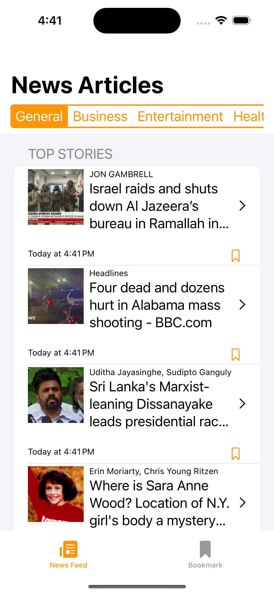
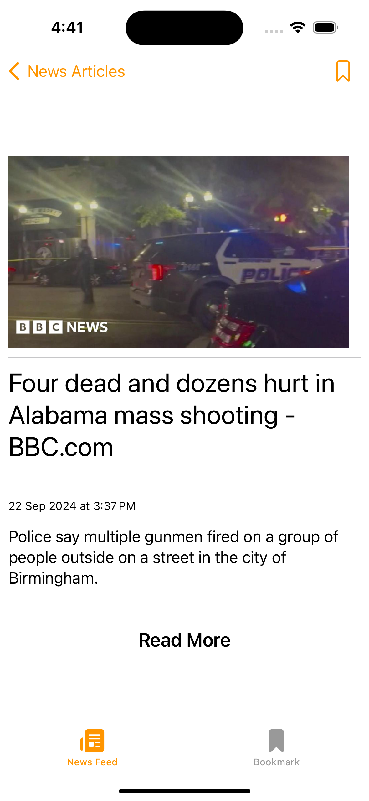
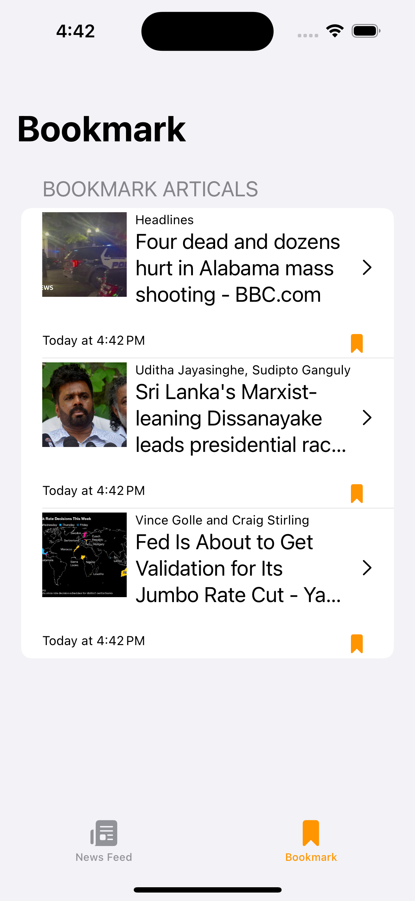
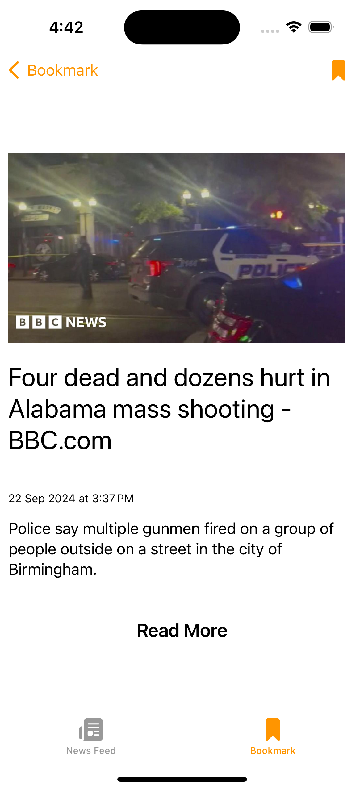
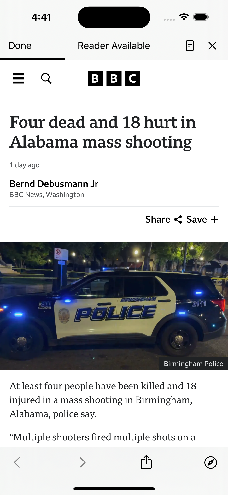

<a id="readme-top"></a>
<br />
<div align="center">
  <a href="https://github.com/othneildrew/Best-README-Template">
    
  </a>

  <h3 align="center">Read Me</h3>

  <p align="center">
    Coding Assignment: News Reader App

This assignment evaluates your skills in building a well-architected and modern iOS application. It focuses on utilizing recent trends in iOS development.

Application Description:
Develop a simple news reader application that fetches news articles from a public API (e.g., News API) and displays them in a user-friendly interface. Users should be able to:

• Browse a list of news articles with titles and summaries.
• Read the full content of an article by tapping on it.
• Bookmarking articles for later reading.
• Filtering news by category.
TechnicalRequirements:
• Use latest & best practices in iOS App development.
Additional Notes:
• Feel free to choose any public news API to fetch articles.
• You can provide a README file with additional information about your implementation choices and testing strategy.
This assignment aims to assess your ability to leverage the latest trends in iOS development while building a well-architected and maintainable application.
  </p>
</div>

###Screenshots

Here are few screenshots from the app 
 
  <a href="">
    
    
  </a>
    <a href="">
    
    
  </a>
  </a>
    <a href="">
    
  </a>


### Installation

Please follow the below steps to install and run the NewReader App

1. Get a free API Key at [https://newsapi.org/](https://newsapi.org/)
2. Clone the repo
   ```sh
   git clone git@github.com:avinashtag/NewsReader.git
   ```
3. Install Swift packages
   ```sh
   git@github.com:elai950/AlertToast.git
   ```
4. Enter your API in `NewsFeedEndpoint.swift`
   ```js
   "X-Api-Key" = "a859cb9819a44c7bb7643f1db7ae13c6"
   ```

<p align="right">(<a href="#readme-top">back to top</a>)</p>
